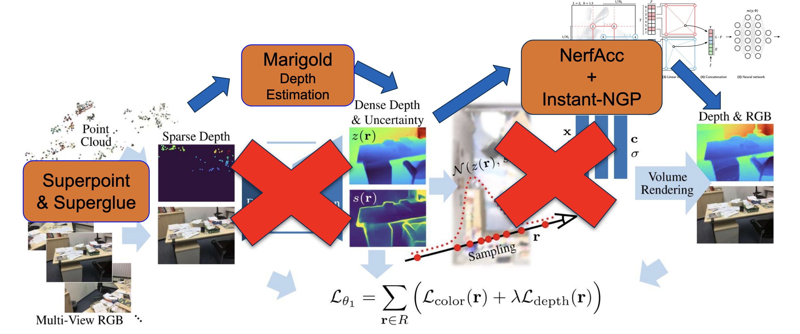

# Dense Depth Priors for Efficient NeRF from Sparse Input Views using Depth Estimation
This repository contains the an expansion build over the CVPR 2022 paper: Dense Depth Priors for Neural Radiance Fields from Sparse Input Views.

[Arxiv](https://arxiv.org/abs/2112.03288) | [Video](https://t.co/zjH9JvkuQq) | [Project Page](https://barbararoessle.github.io/dense_depth_priors_nerf/)



## Step 0: Install environment

```
conda create —name nerfacc python=3.10
conda activate nerfacc
conda install nvidia/label/cuda-11.8.0::cuda nvidia/label/cuda-11.8.0::cuda-toolkit ninja -y

pip3 install -r requirements.txt

pip3 install nerfacc -f https://nerfacc-bucket.s3.us-west-2.amazonaws.com/whl/torch-2.0.0_cu118.html

pip install git+https://github.com/NVlabs/tiny-cuda-nn/#subdirectory=bindings/torch

# This may be useful in case of problems with gcc
# conda install -c conda-forge gcc gxx gcc_linux-64"<11.0.0" libgcc"<11.0.0" gxx_linux-64 -y

# This might be useful if some cuda files can not be found e.g. cudart
# ln -s ~/anaconda3/envs/<py310>/lib  ~/anaconda3/envs/<py310>/lib64
```

Default cuda version can be changed accordingly, but requires modification in the requirements.txt file + probably change of pytorch version.

## Step 1: Obtain Dense Depth Priors

### Prepare ScanNet++
Download a scene from the [ScanNet++](https://github.com/scannetpp/scannetpp) dataset, download the desired scene and undistort the images.

### Compute camera parameters
Run the [SuperPoint](https://github.com/rpautrat/SuperPoint) keypoint detector and the [SuperGlue](https://github.com/magicleap/SuperGluePretrainedNetwork) feature matching. Then run [COLMAP](https://github.com/colmap/colmap) bundle adjustment step on all RGB images of ScanNet++.
For this, the RGB files need to be isolated from the other scene data, f.ex. create a temporary directory `tmp` and copy each `<scene>/color/<rgb_filename>` to `tmp/<scene>/color/<rgb_filename>`.
Then run:
```
colmap feature_extractor  --database_path scannet_sift_database.db --image_path tmp
```
When working with different relative paths or filenames, the database reading in `scannet_dataset.py` needs to be adapted accordingly.

### Create configuration

Run the notebook `depth_alignment\generate_config.ipynb` to generate the `config.json` file needed to relate COLMAP scale to metric scale.

### Depth Estimation using Marigold

Run the Google Colab notebook `depth_estimation\estimate_depth_marigold.ipynb` to obtain monocular affine-invariant depth predictions for all the images in the scene.

## Step 2: Optimizing NeRF with Dense Depth Priors
### Prepare scenes
You can skip the scene preparation and directly download the [scene](https://drive.google.com/drive/folders/1jiR3_yF9KpfL0wa5I5URfykS1_EBg81d?usp=sharing).
To prepare a scene and render sparse depth maps from COLMAP sparse reconstructions, run:
```
cd preprocessing
mkdir build
cd build
cmake ..
make -j
./extract_scannet_scene <path to scene> <path to ScanNet>
```
The scene directory must contain the following:
- `train.csv`: list of training views from the ScanNet scene
- `test.csv`: list of test views from the ScanNet scene
- `config.json`: parameters for the scene:
  - `name`: name of the scene
  - `max_depth`: maximal depth value in the scene, larger values are invalidated
  - `dist2m`: scaling factor that scales the sparse reconstruction to meters
  - `rgb_only`: write RGB only, f.ex. to get input for COLMAP
- `colmap`: directory containing 2 sparse reconstruction:
  - `sparse`: reconstruction run on train and test images together to determine the camera poses
  - `sparse_train`, reconstruction run on train images alone to determine the sparse depth maps.

Please check the provided scene as an example.

### Depth Prior Alignment

To obtain metric depth prior run the notebook `depth_alignment\align_depth_map_MG_scannetpp.ipynb` to transform the affine-invariant depth prior to metric scale.

### Optimize
```
python3 run_nerf.py train --scene_id <scene, e.g. scene0710_00> --data_dir <directory containing the scenes> --depth_prior_network_path <path to depth prior checkpoint> --ckpt_dir <path to write checkpoints>
```
Checkpoints are written into a subdirectory of the provided checkpoint directory. The subdirectory is named by the training start time in the format `jjjjmmdd_hhmmss`, which also serves as experiment name in the following.

### Test
```
#original
python3 run_nerf.py test --expname <experiment name> --data_dir <directory containing the scenes> --ckpt_dir <path to write checkpoints>

#modified
python3 run_nerfacc.py train
--scene_id <scene> --data_dir <directory containing the scenes> \
--depth_completion <resnet|marigold> --depth_prior_network_path <if resnet> \
--ckpt_dir <path to write checkpoints> --max_num_rays 1024 --occ_resolution 128 \
--render_step_size 1e-3 --occ_num_levels 6 --model_type ngp --netwidth 128 \
--log2_hashmap_size 22 --N_training_steps 15000  --lrate 1e-2 --ngp_max_resolution 524288 \
--i_print 1000 --i_img 3000  # frequence of printing and evaluation

```
The test results are stored in the experiment directory.
Running `python3 run_nerf.py test_opt ...` performs test time optimization of the latent codes before computing the test metrics.

### Render Video
```
python3 run_nerf.py video  --expname <experiment name> --data_dir <directory containing the scenes> --ckpt_dir <path to write checkpoints>
```
The video is stored in the experiment directory.

---

### Acknowledgements
We thank [Dense Depth Priors NeRF](https://github.com/barbararoessle/dense_depth_priors_nerf) which we use as a baseline, additionally we thank [nerf-pytorch](https://github.com/yenchenlin/nerf-pytorch) and [CSPN](https://github.com/XinJCheng/CSPN), from which the original repository borrows code.
